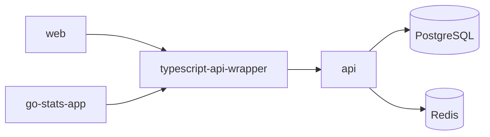

A sports statistics platform with a Go API, Next.js web app, React Native mobile app, and shared TypeScript SDK.

## Repositories

| Repo | Description | Stack |
|------|-------------|-------|
| [api](https://github.com/go-stats/api) | REST API and multi-service backend (API server, WebSocket server, sport workers, background workers) | Go, PostgreSQL, Redis, Docker |
| [web](https://github.com/go-stats/web) | Web application | Next.js, React, TypeScript, Tailwind CSS |
| [go-stats-app](https://github.com/go-stats/go-stats-app) | Mobile app (iOS and Android) | React Native, Expo, TypeScript, NativeWind |
| [typescript-api-wrapper](https://github.com/go-stats/typescript-api-wrapper) | Shared TypeScript SDK (`@go-stats/api`), published to GitHub Packages. Provides API client and React Query hooks. | TypeScript, dual ESM + CJS |

## Architecture

Both frontends consume the API through the shared SDK, which provides a typed API client and React Query hooks. The API handles HTTP and WebSocket connections and delegates background processing to workers.

## API Services

The `api` repo runs several services:

- **API server** (`:8080`) -- REST endpoints, auth (JWT, WebAuthn/passkey, OAuth2), RBAC
- **WebSocket server** (`:8081`) -- real-time updates via Redis pub/sub
- **Sport workers** -- basketball, football, soccer event processing
- **Background workers** -- video (FFmpeg), email, SMS, push notifications, aggregate views, stats recalculation

## Web App

The `web` repo is a Next.js 16 application (App Router, React 19):

- **NextAuth v5** -- JWT sessions, OAuth2, WebAuthn/passkey, middleware-based route protection
- **React Query** -- server state with `@go-stats/api` SDK hooks, automatic token refresh on 401
- **WebSocket client** -- real-time updates with auto-reconnect, heartbeat, and channel subscriptions
- **Radix UI** -- accessible component primitives (dialog, dropdown, select, tabs, toast, etc.)
- **Vitest + MSW** -- unit tests with API mocking (80% coverage threshold)
- **Playwright** -- E2E tests with persistent auth state

## Mobile App

The `go-stats-app` repo is a React Native 0.83 / Expo 55 application:

- **Expo Router** -- file-based navigation with typed routes and deep linking (`gostats://`)
- **expo-secure-store** -- encrypted token storage, automatic refresh via `@go-stats/api` SDK
- **react-native-passkey** -- WebAuthn/passkey authentication
- **React Query** -- server state with `@go-stats/api` SDK hooks
- **WebSocket client** -- real-time updates with auto-auth and auto-connect
- **NativeWind** -- Tailwind CSS for React Native with automatic dark mode
- **EAS Build** -- development, preview, and production profiles for iOS and Android

## Deployed Environment

| Provider | Service | What it runs |
|----------|---------|--------------|
| [**Cloudflare**](https://dash.cloudflare.com) | DNS | Domain resolution |
| | CDN | Static web images |
| | R2 | Uploaded image storage |
| | Push | Web push notifications |
| [**Render**](https://dashboard.render.com) | Web Service | API server, WebSocket server |
| | Background Workers | Basketball, football, soccer, video, email, SMS, push, aggregate-views, stats-recalc |
| | PostgreSQL | Primary database |
| | Redis | Event streams, caching, job queues |
| [**Vercel**](https://vercel.com/indielab/gostats.io) | Hosting | Next.js web app |
| [**Dash0**](https://app.dash0.com) | Observability | Traces, metrics, logs (OpenTelemetry) |

## Tooling

- **mise** -- tool version management (all repos)
- **pnpm** -- package manager (all Node.js repos)
- **make** -- task runner (api)
- **air** -- hot reload for Go
- **goreman** -- runs all API services locally
- **golang-migrate** -- database migrations
- **Playwright** -- E2E tests (web)
- **Vitest** -- unit tests (web, SDK)
- **MSW** -- API mocking in frontend tests
- **GitHub Actions** -- CI/CD

All repos follow a consistent validation order: format check, build, lint, test.

## Getting Started

1. Install [mise](https://mise.jdx.dev). Run `mise install` in any repo to get the correct tool versions.
2. Clone the repo(s) you need.
3. Follow the README in each repo for setup instructions.

For a full-stack local setup, start with **api** (database + API), then **typescript-api-wrapper** (build the SDK), then **web** or **go-stats-app**.

Each repository README has detailed setup instructions. This document does not duplicate them.
