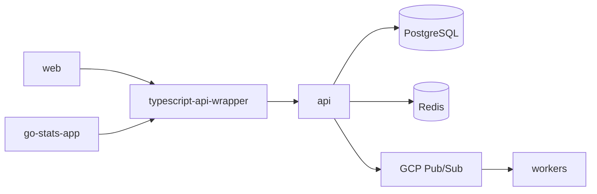

A sports statistics platform with a Go API, Next.js web app, React Native mobile app, and shared TypeScript SDK.

## Repositories

| Repo | Description | Stack |
|------|-------------|-------|
| [api](https://github.com/go-stats/api) | REST API and multi-service backend (API server, WebSocket server, sport workers, background workers) | Go, PostgreSQL, Redis, GCP Pub/Sub |
| [web](https://github.com/go-stats/web) | Web application | Next.js, React, TypeScript, Tailwind CSS |
| [go-stats-app](https://github.com/go-stats/go-stats-app) | Mobile app (iOS and Android) | React Native, Expo, TypeScript, NativeWind |
| [typescript-api-wrapper](https://github.com/go-stats/typescript-api-wrapper) | Shared TypeScript SDK (`@go-stats/api`), published to GitHub Packages. Provides API client and React Query hooks. | TypeScript, dual ESM + CJS |
| [infra](https://github.com/go-stats/infra) | GCP infrastructure as code (Pulumi) | TypeScript, Pulumi, GCP |

## Architecture

Both frontends consume the API through the shared SDK, which provides a typed API client and React Query hooks. The API handles HTTP and WebSocket connections and publishes jobs to GCP Pub/Sub for asynchronous worker processing.

## API Services

The `api` repo runs several services:

- **API server** (`:8080`) -- REST endpoints, auth (JWT, WebAuthn/passkey, OAuth2), RBAC
- **WebSocket server** (`:8081`) -- real-time updates via Redis pub/sub
- **Sport workers** -- basketball, football, soccer, seven-on-seven event processing
- **Background workers** -- video (FFmpeg), email, SMS, push notifications, aggregate views, webhook delivery, usage tracking

## Web App

The `web` repo is a Next.js 16 application (App Router, React 19):

- **NextAuth v5** -- JWT sessions, OAuth2, WebAuthn/passkey, middleware-based route protection
- **React Query** -- server state with `@go-stats/api` SDK hooks, automatic token refresh on 401
- **WebSocket client** -- real-time updates with auto-reconnect, heartbeat, and channel subscriptions
- **Radix UI** -- accessible component primitives (dialog, dropdown, select, tabs, toast, etc.)
- **Vitest + MSW** -- unit tests with API mocking (80% coverage threshold)
- **Playwright** -- E2E tests with persistent auth state

## Mobile App

The `go-stats-app` repo is a React Native 0.83 / Expo 55 application:

- **Expo Router** -- file-based navigation with typed routes and deep linking (`gostats://`)
- **expo-secure-store** -- encrypted token storage, automatic refresh via `@go-stats/api` SDK
- **react-native-passkey** -- WebAuthn/passkey authentication
- **React Query** -- server state with `@go-stats/api` SDK hooks
- **WebSocket client** -- real-time updates with auto-auth and auto-connect
- **NativeWind** -- Tailwind CSS for React Native with automatic dark mode
- **EAS Build** -- development, preview, and production profiles for iOS and Android

## Infrastructure

The platform runs on **GCP** (`us-east1`) with **dev** and **prod** environments managed by [Pulumi](https://github.com/go-stats/infra). Dev scales to zero; prod is always-on with HA.

| Layer | Service | Notes |
|-------|---------|-------|
| **Compute** | Cloud Run | API, WebSocket, web, and worker services |
| **Database** | Cloud SQL PostgreSQL 17 | Private networking via VPC |
| **Cache** | Memorystore Redis 7.2 | BASIC (dev), STANDARD_HA (prod) |
| **Messaging** | GCP Pub/Sub | Durable worker job queues with dead-letter topics |
| **Real-time** | Redis Pub/Sub | WebSocket broadcast |
| **Storage** | Cloudflare R2 | Uploaded files and images |
| **Security** | Cloud Armor WAF, IAM, Secret Manager | OWASP CRS rules, per-service least-privilege |
| **Networking** | VPC + Serverless Connector | Private database and cache access |
| **Registry** | Artifact Registry | Docker images |
| **DNS/CDN** | Cloudflare | Domain resolution and static assets |
| **CI/CD** | GitHub Actions | Workload Identity Federation (keyless GCP auth) |
| **Observability** | Dash0 | OpenTelemetry traces, metrics, logs |
| **IaC** | Pulumi (TypeScript) | All GCP resources |

## Tooling

- **mise** -- tool version management (all repos)
- **pnpm** -- package manager (all Node.js repos)
- **make** -- task runner (api)
- **air** -- hot reload for Go
- **goreman** -- runs all API services locally
- **golang-migrate** -- database migrations
- **Playwright** -- E2E tests (web)
- **Vitest** -- unit tests (web, SDK)
- **MSW** -- API mocking in frontend tests
- **GitHub Actions** -- CI/CD

All repos follow a consistent validation order: format check, build, lint, test.

## Getting Started

1. Install [mise](https://mise.jdx.dev). Run `mise install` in any repo to get the correct tool versions.
2. Clone the repo(s) you need.
3. Follow the README in each repo for setup instructions.

For a full-stack local setup, start with **api** (database + API), then **typescript-api-wrapper** (build the SDK), then **web** or **go-stats-app**.

Each repository README has detailed setup instructions. This document does not duplicate them.
