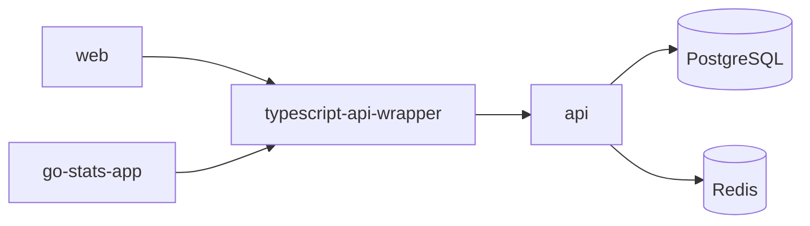

# Go Stats

A sports statistics platform with a Go API, Next.js web app, React Native mobile app, and shared TypeScript SDK.

## Repositories

| Repo | Description | Stack |
|------|-------------|-------|
| [api](https://github.com/go-stats/api) | REST API and multi-service backend (API server, WebSocket server, sport workers, background workers) | Go, PostgreSQL, Redis, Docker |
| [web](https://github.com/go-stats/web) | Web application | Next.js, React, TypeScript, Tailwind CSS |
| [go-stats-app](https://github.com/go-stats/go-stats-app) | Mobile app (iOS and Android) | React Native, Expo, TypeScript, NativeWind |
| [typescript-api-wrapper](https://github.com/go-stats/typescript-api-wrapper) | Shared TypeScript SDK (`@go-stats/api`), published to GitHub Packages. Provides API client and React Query hooks. | TypeScript, dual ESM + CJS |

## Architecture

Both frontends consume the API through the shared SDK, which provides a typed API client and React Query hooks. The API handles HTTP and WebSocket connections and delegates background processing to workers.

## API Services

The `api` repo runs several services:

- **API server** (`:8080`) -- REST endpoints, auth (JWT, WebAuthn/passkey, OAuth2), RBAC
- **WebSocket server** (`:8081`) -- real-time updates via Redis pub/sub
- **Sport workers** -- basketball, football, soccer event processing
- **Background workers** -- video (FFmpeg), email, SMS, push notifications, aggregate views, stats recalculation

## Web App

The `web` repo is a Next.js 16 application:

- **Auth** -- JWT sessions, OAuth2 (Google), WebAuthn/passkey registration and login
- **Leagues** -- create/edit leagues, season management, media gallery, browse and follow
- **Teams** -- team creation, roster management, team statistics
- **Games** -- game creation, live stat tracking with sport-specific event logging
- **Players** -- game-by-game stats, season aggregates, player profiles and search
- **Real-time** -- WebSocket-driven live scores and stat updates with auto-reconnect
- **Admin** -- user, league, team, game, and player administration
- **Discovery** -- trending leagues, players, and teams

## Mobile App

The `go-stats-app` repo is a React Native/Expo application (iOS and Android):

- **Auth** -- JWT sessions, OAuth2 (Google), WebAuthn/passkey, secure token storage
- **Dashboard** -- personalized feed with liked leagues, teams, and players
- **Leagues** -- create/edit leagues, season and roster management
- **Games** -- game creation, live stat tracking with WebSocket real-time updates
- **Players** -- player profiles, sport-specific stat tracking and editing
- **Search** -- cross-entity debounced search for leagues, teams, and players
- **Media** -- image uploads via camera/gallery, video playback
- **Dark mode** -- automatic theme switching via system preferences

## Deployed Environment

| Provider | Service | What it runs |
|----------|---------|--------------|
| [**Cloudflare**](https://dash.cloudflare.com) | DNS | Domain resolution |
| | CDN | Static web images |
| | R2 | Uploaded image storage |
| | Push | Web push notifications |
| [**Render**](https://dashboard.render.com) | Web Service | API server, WebSocket server |
| | Background Workers | Basketball, football, soccer, video, email, SMS, push, aggregate-views, stats-recalc |
| | PostgreSQL | Primary database |
| | Redis | Event streams, caching, job queues |
| [**Vercel**](https://vercel.com/indielab/gostats.io) | Hosting | Next.js web app |
| [**Dash0**](https://app.dash0.com) | Observability | Traces, metrics, logs (OpenTelemetry) |

## Tooling

- **mise** -- tool version management (all repos)
- **pnpm** -- package manager (all Node.js repos)
- **make** -- task runner (api)
- **air** -- hot reload for Go
- **goreman** -- runs all API services locally
- **golang-migrate** -- database migrations
- **Playwright** -- E2E tests (web)
- **Vitest** -- unit tests (web, SDK)
- **MSW** -- API mocking in frontend tests
- **GitHub Actions** -- CI/CD

All repos follow a consistent validation order: format check, build, lint, test.

## Getting Started

1. Install [mise](https://mise.jdx.dev). Run `mise install` in any repo to get the correct tool versions.
2. Clone the repo(s) you need.
3. Follow the README in each repo for setup instructions.

For a full-stack local setup, start with **api** (database + API), then **typescript-api-wrapper** (build the SDK), then **web** or **go-stats-app**.

Each repository README has detailed setup instructions. This document does not duplicate them.
